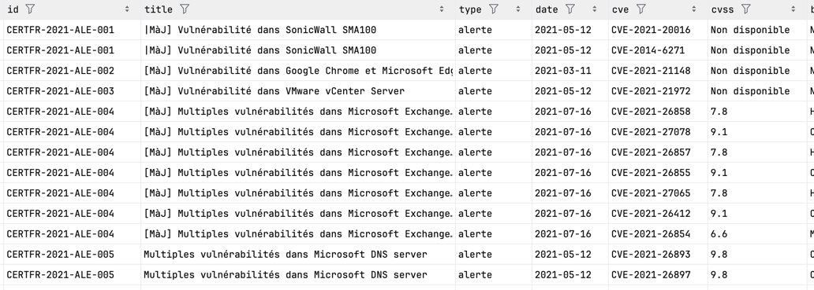
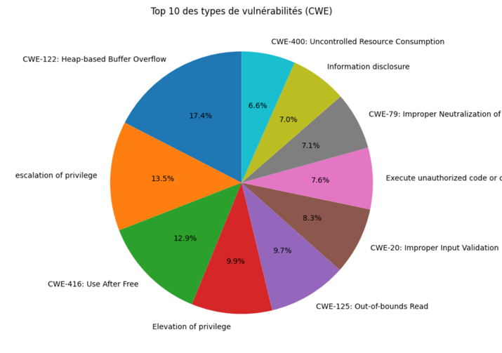
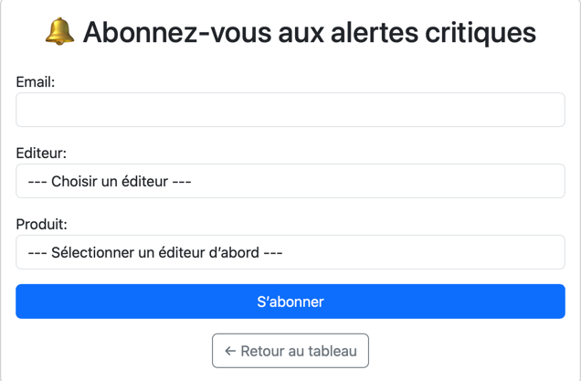
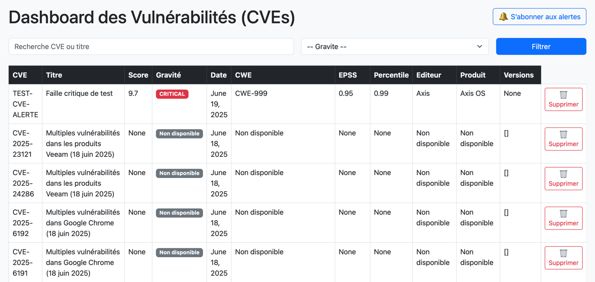

# Projet Mastercamp 2025 – Dashboard de Vulnérabilités ANSSI & Analyse Machine Learning

##  Présentation du projet

Ce projet a pour objectif la création d'une plateforme de suivi et d'analyse des vulnérabilités de cybersécurité publiées par l'ANSSI. Elle est composée de plusieurs grandes parties :

1. **Extraction et enrichissement des données de vulnérabilités (ANSSI, MITRE, FIRST)**
2. **Analyse et visualisation des DataFrame csv**
3. **Création d'un modèle de machine learning supervisé et non supervisé**
4. **Mise en place d'un système de messagerie (EMAIL)**
5. **Dashboard Django avec gestion de base de données et visualisations enrichies**

---

##  Structure du projet

```
ProjetFinalData/
├── core/                # App Django principale
├── dashboard/           # Configuration Django
├── data/                # Données sources à importer (CSV enrichi)
├── manage.py            # Script d’exécution Django
├── mnt/                 # Jupyter Notebooks pour la data science incluant visualisation et machine learning
├── extract_web.py       # Extraction données via api en ligne
├── extract_local.py     # Extraction données via fichiers en local
├── extract_concat.py    # Concaténation des deux DataFrame générés par ext_web et ext_local
└── README.md            # Ce fichier
```

---

##  Installation rapide

### 1. Créer et activer un environnement Python

```bash
python3 -m venv .venv
source .venv/bin/activate  # sous Windows: .venv\Scripts\activate.bat
```

### 2. Installer les dépendances

→ Le fichier `requirements.txt` est inclus à la racine.
```bash
pip install -r requirements.txt
```

### 3. Ajouter les données de base

Dans le dossier `data/`, ajouter le fichier CSV enrichi préalablement (cve_ansi_enriched_final.csv) et le **renommer en** `cve_enriched.csv`.

### 4. Importer les données dans la base

```bash
python manage.py import_cves data/cve_enriched.csv
```

### 5. Lancer le serveur Django

```bash
python manage.py runserver
```

Rendez-vous sur `http://127.0.0.1:8000` pour accéder au dashboard.

---

##  Récupération & enrichissement des données

Trois scripts principaux sont à exécuter pour extraire et enrichir les données :

### 1. `extract_web.py`

* Récupère les alertes et avis depuis le site de l'ANSSI via RSS/JSON
* Appelle les API MITRE et FIRST pour enrichir les CVE
* Génère le fichier `cve_ansi_enriched_web.csv`

### 2. `extract_local.py`

* Recharge les fichiers JSON stockés en local (ANSSI/MITRE/FIRST)
* Produit `cve_ansi_enriched_local.csv`

### 3. `extract_final.py`

* Concatène les deux fichiers CSV précédents
* Supprime les doublons sur la colonne `cve`
* Génère le fichier final `cve_ansi_enriched_final.csv`


---

##  Visualisations & Analyse exploratoire

Un notebook Jupyter est fourni avec plusieurs visualisations clés pour analyser les vulnérabilités :

* Histogramme des scores **CVSS**
* Distribution des types **CWE**
* Courbes **EPSS** et corrélation CVSS/EPSS
* Top 10 des **éditeurs concernés**
* Évolution mensuelle des failles depuis 2021

Ces visualisations permettent de prioriser les vulnérabilités critiques et d’identifier les acteurs les plus exposés.


---

##  Machine Learning appliqué

Le projet intègre une étude de machine learning sur les vulnérabilités :

### Clustering non supervisé (unsupervised)

* **KMeans (cvss, epss, severity)** : permet de regrouper les failles selon leur niveau de risque
* **KMeans (CWE)** : classe automatiquement les descriptions de vulnérabilités

### Prédiction supervisée

* **Arbre de décision (base severity)** : score parfait mais redondant
* **Regression CVSS (text + CWE)** : TF-IDF + one-hot encoding, modèle RandomForest

Ces modèles permettent d'explorer la possibilité d'automatiser l'analyse de risque en fonction de la description ou de la catégorie d’une faille.

---

##  Fonctionnalités Django

* **Dashboard lisible** listant toutes les vulnérabilités
* **Suppression d’entrées** directement via l’interface
* **Enregistrement de l'email et de l'intéret utilisateur** avec formulaire html
* **Envoi d’emails automatiques** toutes les 30 minutes si de nouvelles alertes critiques (CVSS ≥ 9) sont detectées

### Lancement des alertes automatiques

Les alertes critiques sont envoyées grâce à un thread lancé au démarrage (`core/apps.py`) ou via une commande personnalisée :

```bash
python manage.py check_alerts_loop
```



---

##  Objectifs pédagogiques

* Maitrise de l’ETL Python (extraction, nettoyage, enrichissement)
* Utilisation d’API sécurité (MITRE, FIRST)
* Gestion de projet Django (modèles, views, routing, dashboard)
* Analyse de données, visualisation, et machine learning appliqué

---

##  Crédit

Projet réalisé dans le cadre du **Mastercamp 2025**

 Juin 2025  |  Projet Collectif
